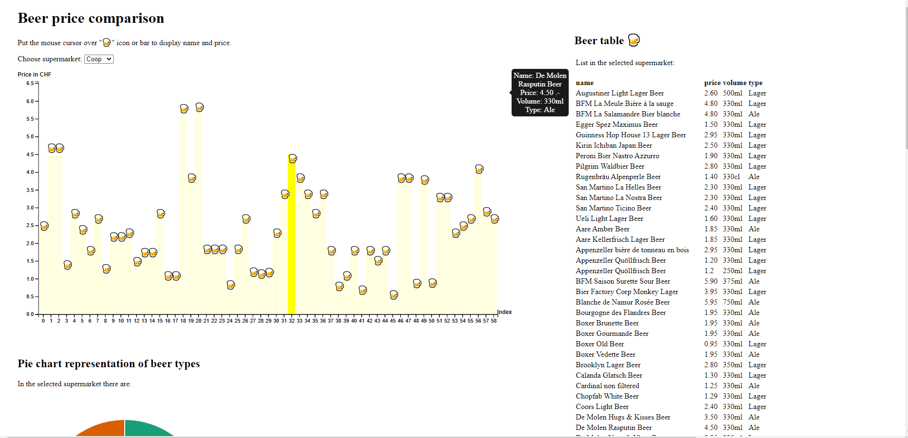
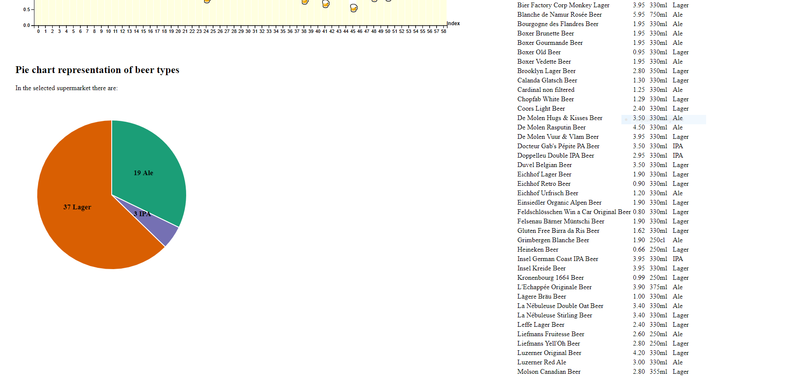

# Visualisation-beer-prices

**Description**

This project was developed as part of the Data Visualization course given by Isaac Pante and Loïc Cattani (SLI, Letters, UNIL). The project was made to compare the beer prices in the largest grocery store chains in Switzerland using d3js. All the necessary data was taken from the websites of Coop and Manor with the help of Parsehub.

**Functionality**

The scrapped files data/manor.json and data/coop.json were deleted from the current directory and stored as variables with the corresponding names in main.js. 

With the help of d3js, this code can make a bar chart, a pie chart and a table using different data as long as it has the following format of JSON [{"name": "name", "price": "price", "volume": "volume", "type": "type"}, ...]. The keys "name", "price", "volume" and "type" should correspond to those used in code. 

Here is a link to [TRY IT OUT!](https://andrei-ctrl.github.io/Visualisation-beer-prices/)

But in the end, the bars were left to show the transition and animate them.

The X axis represents just indexes for each item in JSON. The Y axis represents prices in swiss francs. 

Between bar chart and dot plot representation, I have choosen bar chart because it was not only easier to code, but also it is accurately showing the difference in prices. Else, I used tooltip with mouseover functions to show the beers with long names, their price, volume and types. The pie chart show how many beers of the same category are present in the selected supermarket. The table shows a list of all beers in the selected supermarket. Also, bar chart, pie chart and table change depending on the selected option. 

Merci et bon vent!

