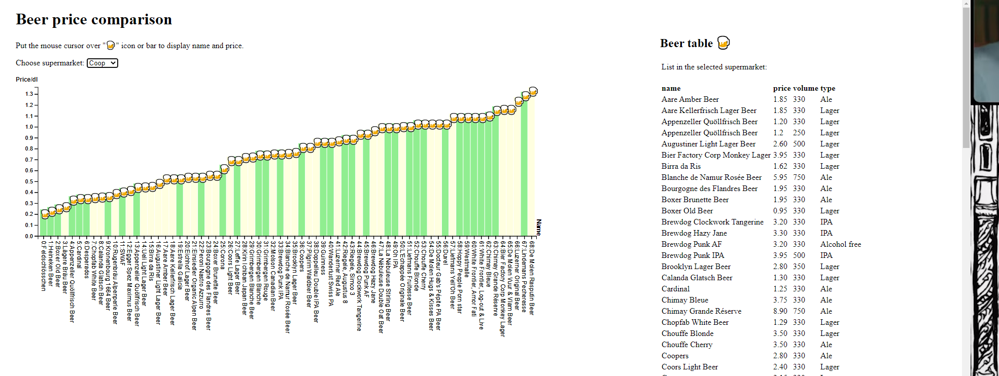
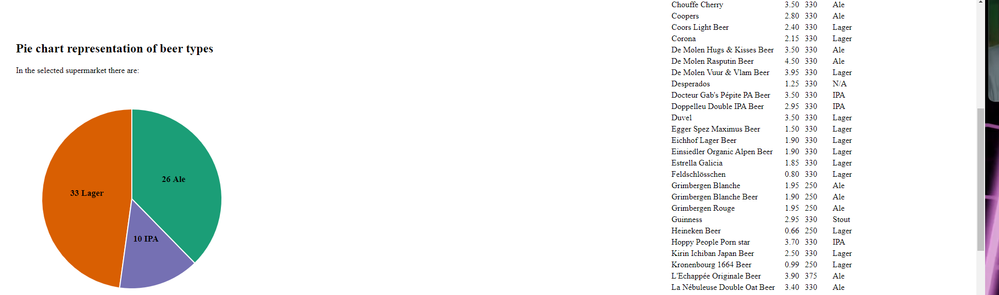

# Visualisation-beer-prices

**Description**

This project was developed as part of the Data Visualization course given by Isaac Pante and Loïc Cattani (SLI, Letters, UNIL). The project was made to compare the beer prices in the largest grocery store chains in Switzerland using d3js. All the necessary data was taken from the websites of Coop and Manor with the help of Parsehub.

**Functionality**

With the help of d3js, this code can make a bar chart, a pie chart and a table using different data as long as it has the following format of JSON [{"name": "name", "price": "price", "volume": "volume", "type": "type"}, ...]. The keys "name", "price", "volume" and "type" should correspond to those used in code. 

Some bars are colored in green, others are colored in yellow. This is made to highlight those beers that are present in both supermarkets, specifically green bars. And thus, they can be compared directly. Also, the bars are displayed in ascending order according to price/dl. 

Here is a link to [try it out!](https://andrei-ctrl.github.io/Visualisation-beer-prices/)

The X axis represents indexes and names for each item in JSON. The Y axis represents prices per deciliter in swiss francs. 

Between bar chart and dot plot representation, I have choosen bar chart because it was not only easier to code, but also it is accurately showing the difference in prices. Else, I used tooltip with mouseover functions to show the beers with long names, their price, volume, types, and price/dl. The pie chart show how many beers of the same category are present in the selected supermarket. The table shows a list of all beers in the selected supermarket sorted by A-Z order. Also, bar chart, pie chart and table change depending on the selected option. Certainly, there are possibly a lot of room for upgrades. However the project meets its initial aim of comparing beer prices. 

