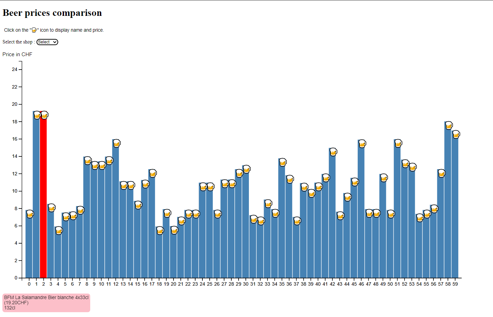

# Visualisation-beer-prices

**Beer prices in different shop** 

**Description**

This project was made to compare the beer prices in the largest grocery store chains in Switzerland. All the necessary data was taken from the websites of Coop and Manor with the help of Parsehub. 

**Functionality**

With the help of d3js, this code can make a bar chart using different data as long as it has the following format of JSON [{"name": "name", "price": "2.60"},{"name": "name","price": "1.85"}]. The keys "name" and "price" should correspond to those used in code.

At first, on click the bar changed its color to red and below the beer description was displayed.

Secondly, I changed this to displaying description by clicking on the beer emoji.

But in the end, the bars were left to show the transition and animate them.

The X axis represents just indexes for each item in JSON as there is not really a good use for this axis. The Y axis represents the price in swiss francs. 

Also, I wanted to make the selection options to change input data for the chart. But I didn't succeed in implementing this functionality from JSON files due to lack of programming knowledge. On the contrary, the chart generates new bars with new data because I manually inserted two JSON files in two variables var coop and var manor in main.js. However, even without counting those two variables, the code is very heavy (~525 lines) with not really impressive functionality. Hence, the code can be extremely improved.

Between bar chart and dot plot representation, I have choosen bar chart because it was not only easier to code, but also it is accurately showing the difference in prices. Else, I used tooltip with mouseover functions to show the beers with long names, their price and volume. 

